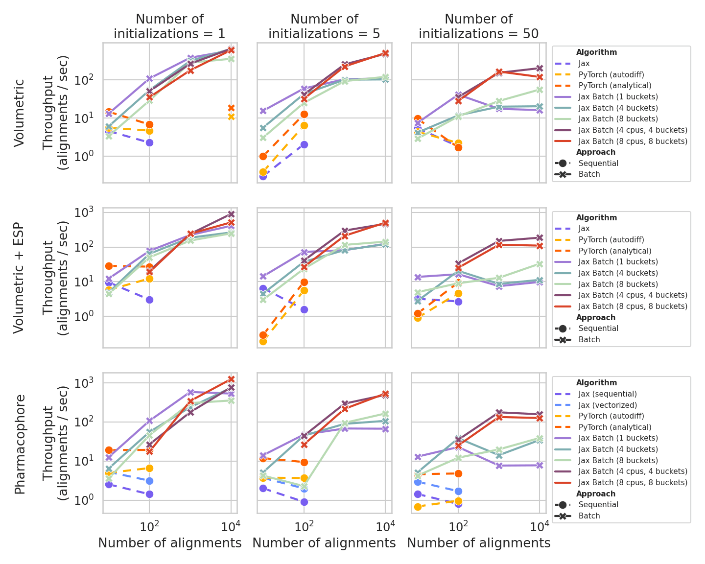
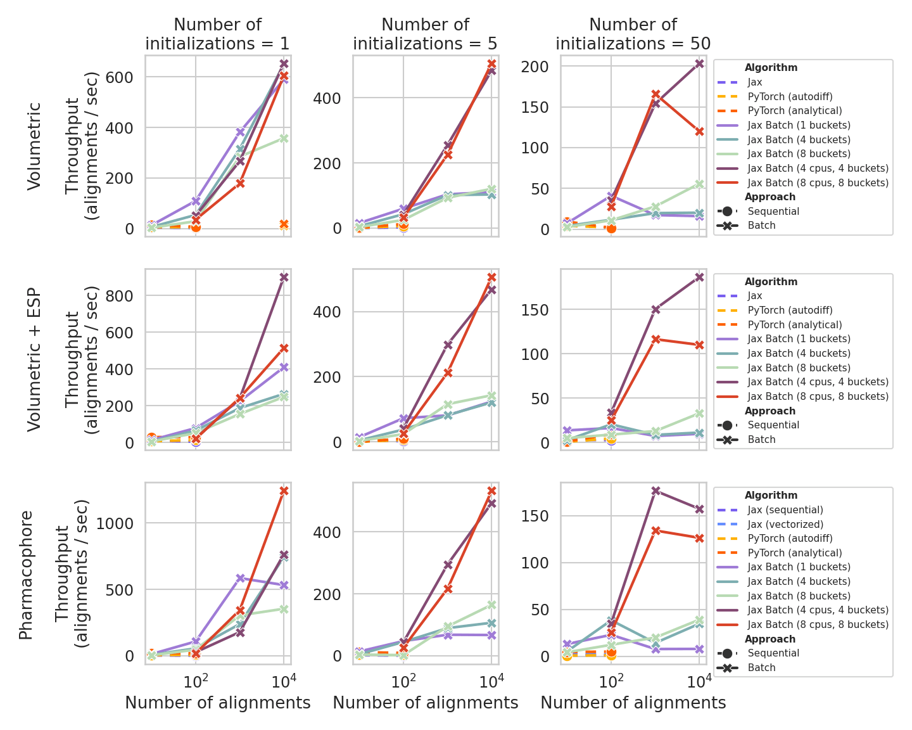

Alignment Throughput
====================

The following reports throughput for several alignment modes on a Linux HPC system.
They summarize how backend and batching choices affect wall-clock cost across workloads.

## Experiment
Experiments use 98 diverse drugs (50–800 g/mol), randomly paired under a fixed seed with shared embedded conformers.
Alignments are run through the `MoleculePair` and `MoleculePairBatch` APIs, which wrap the same optimization routines.
The figure below focuses on volumetric, volumetric + ESP (partial charge), and pharmacophore alignment for pair counts from 10 to 10,000 at each order of magnitude.

We also vary the number of SE(3) initializations (`num_repeats`) at 1, 5, and 50.
The default in `MoleculePair` and `MoleculePairBatch` is 50, which matters most for surface and surface + ESP similarity; for non-surface modes, five repeats are typically adequate.
The five-initialization setting corresponds to one identity alignment plus four principal-component–based starts.
The four principal-component starts match the intiialization count in RDKit/PubChem shape–color alignment.
Tabulated results below therefore use `num_repeats = 5`.

> Note:
For the sequential alignments, `optimize_{*}_overlay{*}` functions were directly used rather than through the API call in MoleculePair.

## Benchmark results

At small batch sizes, the PyTorch analytical-gradient path is generally fastest and remains the default in `MoleculePair` as it is easily parallelizable via multiprocessing across devices--unlike Jax.
For longer runs where the number of pairs grows, padded-batch Jax (`MoleculePairBatch` which  unifies shapes under-the-hood) improves throughput once alignment count is on the order of 100 or higher, chiefly because a single JIT compilation amortizes over the batch.
Additional speedup is possible with multi-device parallelism via `shard_map`; the gain may be hardware- and environment-dependent.
Bucketing groups similarly sized molecules to reduce padding overhead but increases the number of distinct compiled kernels, so it trades wasted arithmetic against compilation cost; it is most valuable when molecular size varies widely across the set.

## Tabulated throughput for different modalities at `num_repeats = 5`

The tables list throughputs for `num_repeats = 5` by modality.
Configurations that exhausted memory—notably batched surface and surface+ESP runs—are omitted; batched surface alignment is not recommended in this setting.
Sequential alignment via `MoleculePair` for Jax and PyTorch modalities were only evaluated for <100 pairs because these do not scale.
Multiprocessed `MoleculePairBatch` was evaluated for >100 pairs.

### Volumetric alignment — alignments/s

| Approach | n = 10 | n = 100 | n = 1000 | n = 10000 |
|---|---:|---:|---:|---:|
| Jax Volume | 0.30 | 2.05 | - | - |
| PyTorch (autodiff) | 0.39 | 6.35 | - | - |
| PyTorch (analytical) | 1.00 | 12.54 | - | - |
| Jax Batch (1 bucket) | **15.54** | **59.57** | 103.69 | 110.59 |
| Jax Batch (4 buckets) | <u>5.63</u> | <u>42.63</u> | 101.42 | 103.18 |
| Jax Batch (8 buckets) | 3.08 | 25.01 | 93.00 | 120.69 |
| Jax Batch (4 cpus, 4 buckets) | - | 41.51 | **255.56** | <u>484.05</u> |
| Jax Batch (8 cpus, 8 buckets) | - | 31.99 | <u>225.60</u> | **506.64** |

### Volumetric + ESP alignment — alignments/s

| Approach | n = 10 | n = 100 | n = 1000 | n = 10000 |
|---|---:|---:|---:|---:|
| Jax Volume+ESP | <u>6.52</u> | 1.58 | - | - |
| PyTorch (autodiff) | 0.19 | 5.57 | - | - |
| PyTorch (analytical) | 0.29 | 9.84 | - | - |
| Jax Batch (1 bucket) | **14.35** | **72.49** | 81.25 | 123.70 |
| Jax Batch (4 buckets) | 4.54 | 37.55 | 81.90 | 121.04 |
| Jax Batch (8 buckets) | 3.02 | 23.59 | 115.76 | 143.04 |
| Jax Batch (4 cpus, 4 buckets) | - | <u>40.92</u> | **299.10** | <u>468.43</u> |
| Jax Batch (8 cpus, 8 buckets) | - | 26.68 | <u>212.16</u> | **506.33** |

### Pharmacophore alignment — alignments/s

| Approach | n = 10 | n = 100 | n = 1000 | n = 10000 |
|---|---:|---:|---:|---:|
| Jax Pharmacophore (base) | 2.01 | 0.91 | - | - |
| Jax Pharmacophore (vectorized) | 3.73 | 2.00 | - | - |
| PyTorch (autodiff) | 3.77 | 3.68 | - | - |
| PyTorch (analytical) | <u>11.90</u> | 9.45 | - | - |
| Jax Batch (1 bucket) | **14.15** | **47.61** | 68.13 | 67.26 |
| Jax Batch (4 buckets) | 5.17 | <u>44.84</u> | 89.49 | 106.80 |
| Jax Batch (8 buckets) | 4.25 | 2.29 | 95.04 | 164.53 |
| Jax Batch (4 cpus, 4 buckets) | - | 44.08 | **294.72** | <u>492.94</u> |
| Jax Batch (8 cpus, 8 buckets) | - | 26.46 | <u>216.67</u> | **532.53** |

### Surface alignment — alignments/s

| Approach | n = 10 | n = 100 | n = 1000 | n = 10000 |
|---|---:|---:|---:|---:|
| Jax Surface | <u>3.72</u> | <u>4.12</u> | - | - |
| PyTorch (autodiff) | 0.88 | 1.83 | - | - |
| PyTorch (analytical) | 1.78 | 3.70 | - | - |
| Jax Batch (1 bucket) | **4.76** | **4.88** | **6.63** | <u>4.34</u> |
| Jax Batch (4 cpus, 4 buckets) | - | - | - | **6.68** |

### Surface + ESP alignment — alignments/s

| Approach | n = 10 | n = 100 | n = 1000 | n = 10000 |
|---|---:|---:|---:|---:|
| Jax Surface+ESP | 2.65 | <u>3.80</u> | - | - |
| PyTorch (autodiff) | 0.65 | 2.76 | - | - |
| PyTorch (analytical) | **3.02** | **4.57** | - | - |
| Jax Batch (1 bucket) | <u>2.85</u> | 2.30 | **2.71** | - |

## Experiment results (semi-log plot)

